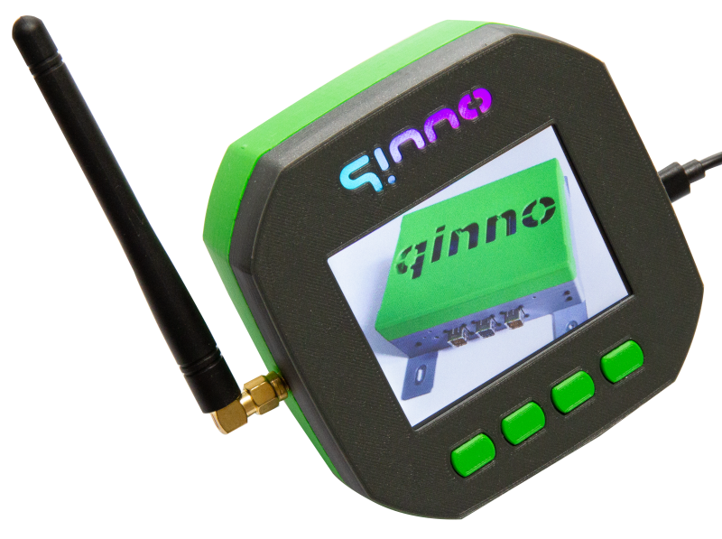

# qEdge-UI

# Update
qEdge-UI supports now PICO2-W plattform (RP2350) with minimum changes as qEdge-UI++. Compilation now works in the Arduino 2.x.x IDE. LittleFS upload does not work in the moment, copy the files in /data to the SD-card, system copies it automagically to LittleFS on the first start. 

# About

This project is an example of use of what can be achieved with free/libre and open source software and free/libre and open source tools in a professional proceeding. 
In contrast to the generally accepted approach of commercial companies, the development results of this project (hardware and mechanical design, as well as software source code) are also available under an open source licence.

Based on the Raspberry Pi Pico (2), we have created a design that can be used as a starting point for further development. In order to keep things as simple as possible we use the Arduino platform.

Key hardware features of **qEdge-UI (qEdge-UI++)**:

- Raspberry Pi Pico RP2040 (2350)
- Dual-Core ARM Cortex M0+ CPU @133 MHz, [NEW 200 MHz](https://github.com/raspberrypi/pico-sdk/releases/tag/2.1.1) (ARM Cortex M33 @150 MHz or RISC-V)
- 264KB SRAM and 2MB Flash (520 KB / 4MB)
- WiFi + Bluetooth (Pico-W/Pico2-W)
- USB interface and power supply
- additional 12/24 VDC supply
- 3,2" TFT-Display 320x240 with resistive touch
- 4x1 keypad
- expansion connector for UART, I²C, GPIO, ADC
- RS-485 Interface
- Micro-SD-card slot
- LoRa module with stable SMA connector
- RTC with ultracap buffer
- Buzzer
- RGB-LEDs for signalling
- Raspberry Pi 3b/4b connectable (optional, not tested)

# Getting Started

### Electronics

To get started you will need the qEdge-UI electronic boards (main and display adapter). [We provide the full KiCad project here.](Electronics)

### Software

To get started with the software development you need a PC with:

* preinstalled Windows 7 or newer (64Bit), Linux (32/64Bit) or MacOS 10.10 newer
* An Arduino IDE 1.8.x including USB Driver support
* Addional you can use our qEdge-UI examples and libraries as a starting point for your own software development or you can download the precompiled UFS binaries of our qEdge-UI examples. [Here](Software) you can find the sources and installation guideline.

### Mechanics

To create the nice looking electronic box above you need a 3D printer [and the mechanics](Mechanics)

## qEdge-UI Hardware Test App functionality

The main objective of the qEdge-UI HwTestApp software is to check the functionality of the hardware.

* Touch - check precision of touch screen
* Slideshow - show PNG files on SD-Card (micro)
* UART - Test UART1 (RX/TX)
* RS-485 - Test UART2 connected to RS-485 driver (RX/TX)
* Micro-SD-card - check SD-card presence and list files on SD-card
* LittleFS - list, copy, rename and delete files in the filesystem
* LoRa - send/receive LoRa messages
* WiFi - scan and log in a network for receiving NTP time information
* GAME - space shooters clone to show performance
* Info - show system infos
* Keyboard - keyboard emulation
* Settings - set RGB preferences and backlight, test Buzzer

# Roadmap

See the [open issues](https://github.com/qinno/qEdge-UI/issues) for a list of proposed features (and known issues).

# Contributing

First of all, thank you for taking the time to contribute! Contributions are what make the open source community such an amazing place to learn, inspire and create. Every contribution you make benefits everyone else and is **greatly appreciated**.

Please try to create bug reports that are:

- _Reproducible._ Include steps to reproduce the problem.
- _Specific._ Include as much detail as possible: which version, what environment, etc.
- _Unique._ Do not duplicate existing open issues.
- _Scoped to a Single Bug._ One bug per report.

# Use and Regulations

Please note that this is an engineering example and is not certified to European regulations such as CE and RED, so use it at your own risk. If you find this platform helpful, we can assist you in creating a production-ready and certified product.

# Known limitations

This project is at the moment not used in a commercial open source product, but can be used as a starting point for that purpose. Please fell free to contact us for more information.

# Support

Reach out to the maintainer at one of the following places:

- By email which is located at [qinno GmbH · GitHub](https://github.com/qinno)

# Licenses

This project is licensed under the following open source licenses:
* Electronics are under [**CERN-OHL-S V2**](https://ohwr.org/cern_ohl_s_v2.txt)
* Mechanics and Design are under [**CC-BY-NC-4.0**](https://creativecommons.org/licenses/by-nc/4.0/legalcode)
* Software Examples are under [**GPLv3**](https://www.gnu.org/licenses/gpl-3.0.en.html)
   
See corresponding Readme.md files in the folders Electronics, Mechanics and Software for more detailed information.

[Raspberry Pi is a trademark of Raspberry Pi Ltd](http://www.raspberrypi.com/)

# Acknowledgements

Thanks to our partners supporting this project:

* [Our Customer Varmeco for the generous donation of material](https://varmeco.de)

* Axel Isele for the mechanics design

* [Würth Elektronik for free samples for the very first prototypes](https://www.we-online.com/de)

* All qinno-colleagues for their commitment even in their spare time

Thanks also for these awesome resources that were used during the development of the **qEdge-UI**:

* [The KiCAD team for their great CAE tool](https://www.kicad.org/)
* [Earle F. Philhower, III for his Arduino library for the RP2040](https://github.com/earlephilhower/arduino-pico)
* [Bodmer for his versatile TFT-Library](https://github.com/Bodmer/TFT_eSPI)
* [Larry Bank for his PNG extension](https://github.com/bitbank2/PNGdec)
* [The Adafruit Industries Team for their RGB-LED library](https://github.com/adafruit/Adafruit_NeoPixel)
* [The Arduino team for their easy to use (now legacy) IDE](https://www.arduino.cc/en/software)
* [Sandeep Mistry for his handy LoRa library](https://github.com/sandeepmistry/arduino-LoRa)
